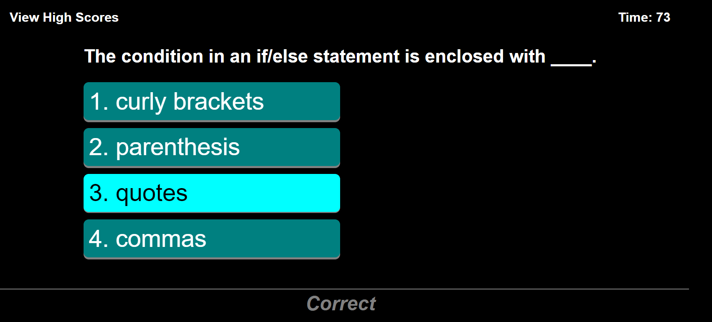

# Coding-Quiz

## Description
A quiz consisting of five coding related questions. Timer begins at 75 seconds. Each incorrect answer will decrease the timer by ten seconds and lower the score by one point. Correct answers will award ten points. You can retry the quiz with the "Go back" button and view your scores by clicking "View High Scores."

## Website

## Screenshot
